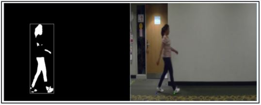
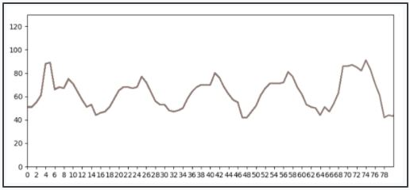
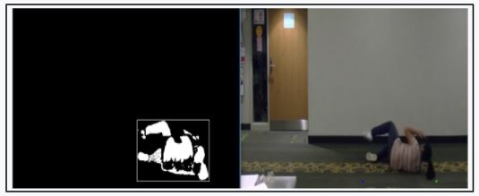
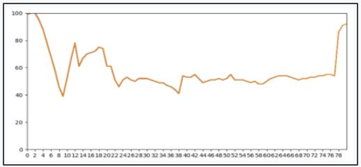
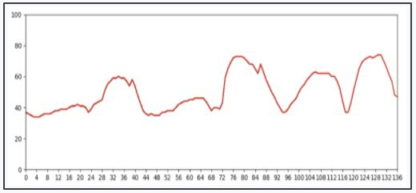
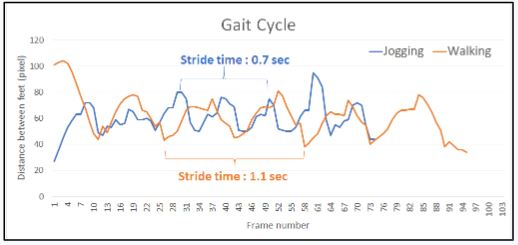
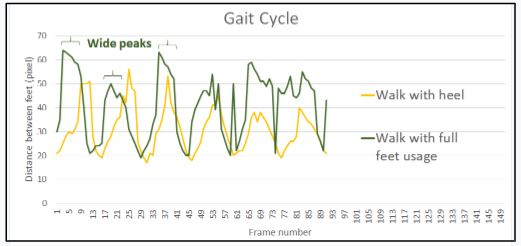
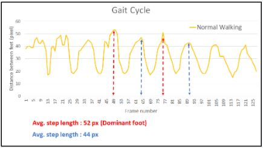

# CCTV_Fall_Detector

Real-time Fall Detection and Gait Analysis of a Person unobtrusively using CCTV footage

### Motivation

**Gait analysis** is a method for identifying biomechanical abnormalities in the gait cycle, i.e.  **the way a person walks.** 
**Abnormal gait**, if gone undetected can be aggrevated by injury and lead to major musculoskeletal and cardiovascular problems.  
Automated Fall detection and gait analysis is crucial in alerting emergency in a number of situations: 
* For a person walking alone in an isolated hallway/street
* Track progress in rehabilitation of individuals having serious musculoskeletal injuries.
* Gait correction for individuals

Popular sensor-based fall detection methods are obtrusive and inconvenient for individuals to wear continuously 

### Objective
* To extract critical gait features from the human silhouette obtained using unobtrusive off-the shelf CCTV infrastructure.
* To trigger an alert system in response to emergency condition such as fainting  to provide medical assistance within the “Golden Hour”
* To perform analysis on gait cycles to infer additional gait and human characteristics 

### Results
#### Case 1: Normal Gait Video tracking 
|  |  |
|:---:|:---:|
| Video frame(heel-strike and foot-off) | Corresponding temporal plot of stride length |

#### Case 2: Abnormal Gait: Subject falls down while walking
|  |  |
|:---:|:---:|
|  Video frame | Corresponding temporal plot of stride length |

### Case 3: Abnormal Gait: Subject drags leg while walking
 

Normal Gait is indicative of periodic pattern of alternate troughs and crest in given temporal plot. In given case, Subject drags right foot and these periodic patterns exist but due to difference in motion type of each leg, immediate crest dont match.

### Analysis
Differentiating different types of walking styles based on proposed gait analysis approach
|  |  |  |
|:---:|:---:|:---:|
| Jogging versus walking | Walking with heel first versus foot first | Different step length for each feet(possible dominant foot indication) |

For more details please check out the [Poster](docs/gait_analysis_poster.jpg) or the [Report](docs/GuptaSanya_KulkarniSamruddhi_PranavCibi.pdf)
